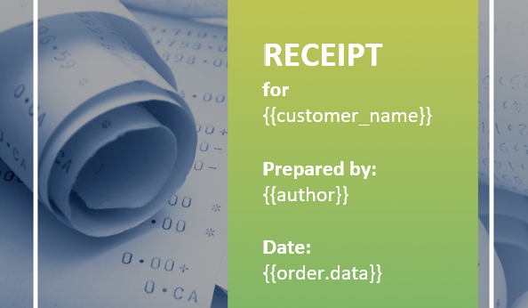
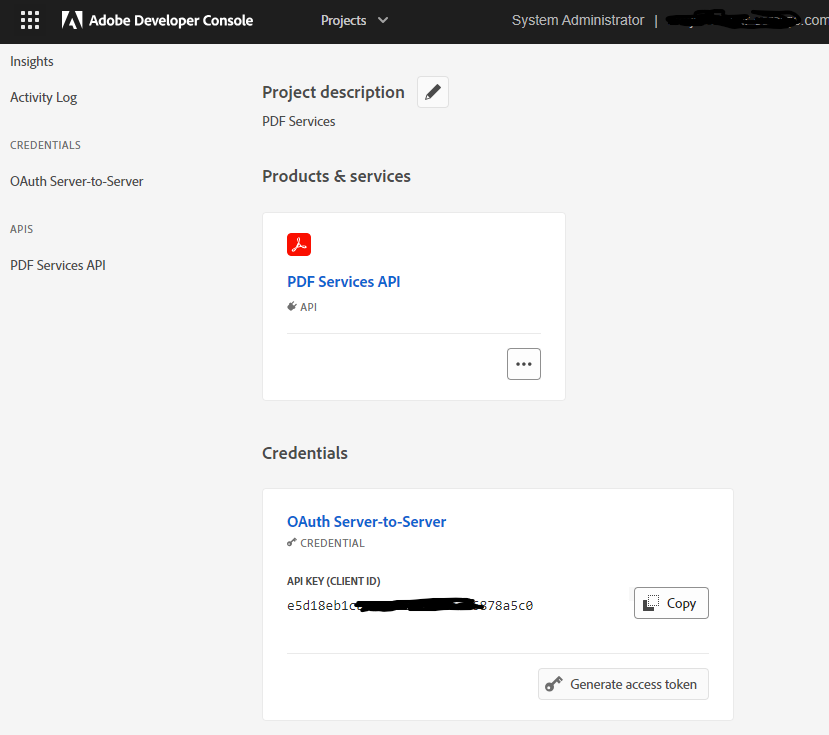
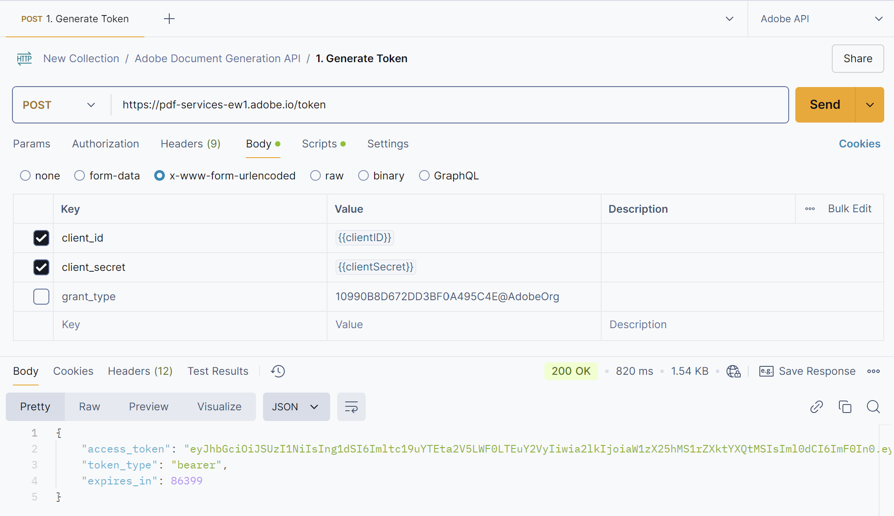
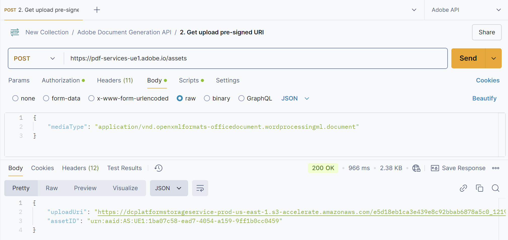
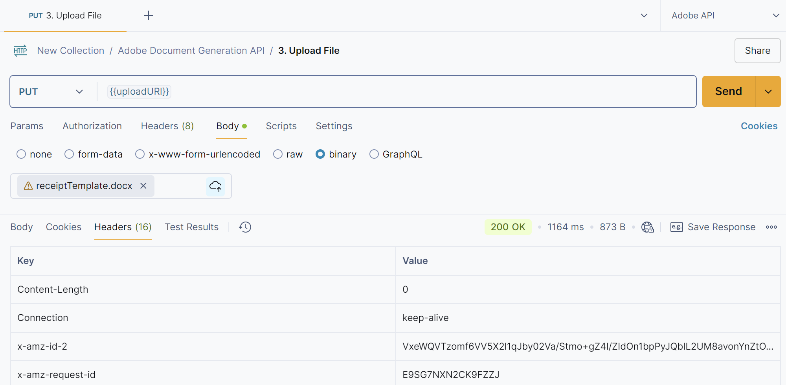
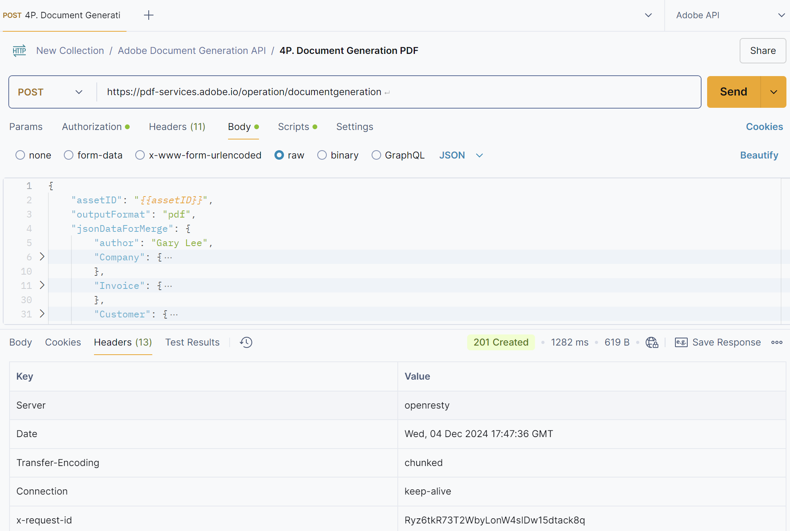
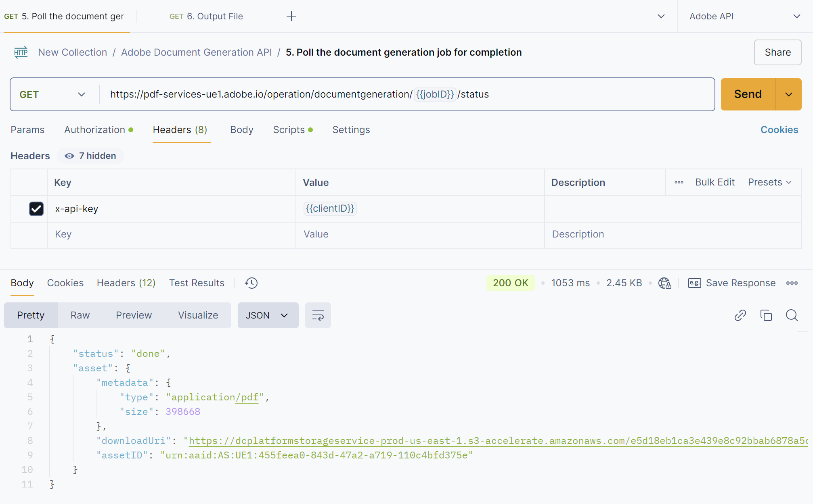
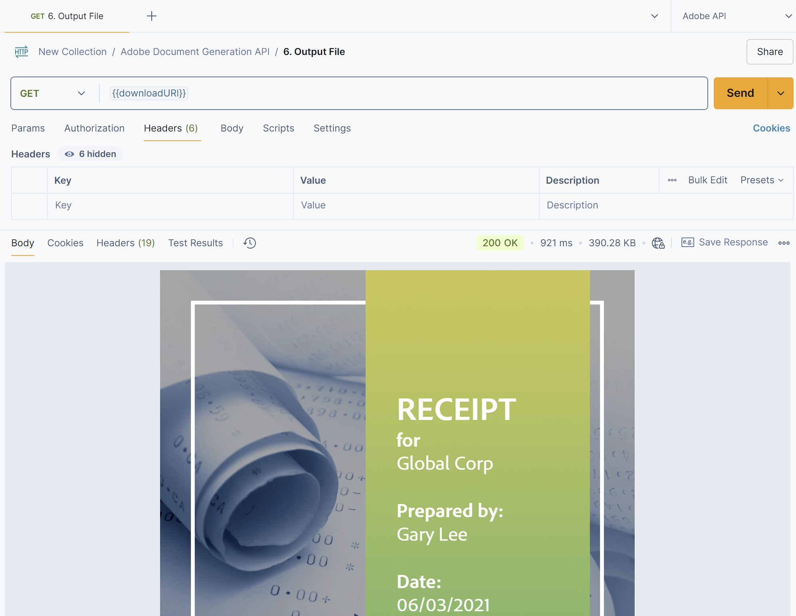

# Template Document Generation using Adobe Document Generation API

## Table of Contents

- [Template Document Generation using Adobe Document Generation API](#template-document-generation-using-adobe-document-generation-api)
  - [Table of Contents](#table-of-contents)
  - [Steps to Generate Token, Upload File, Generate Document (DOCX or PDF), and Retrieve Output](#steps-to-generate-token-upload-file-generate-document-docx-or-pdf-and-retrieve-output)
    - [1. Create a Document Template](#1-create-a-document-template)
    - [2. Prepare Your JSON Data](#2-prepare-your-json-data)
    - [3. Get API Key from Adobe Developer Console](#3-get-api-key-from-adobe-developer-console)
    - [4. Generate Token](#4-generate-token)
    - [5. Get Upload Presigned URI](#5-get-upload-presigned-uri)
    - [6. Upload File](#6-upload-file)
    - [7. Document Generation (DOCX or PDF)](#7-document-generation-docx-or-pdf)
    - [8. Poll the Document Generation Periodically check the status of your document generation job using Adobe's API until it's completed](#8-poll-the-document-generation-periodically-check-the-status-of-your-document-generation-job-using-adobes-api-until-its-completed)
    - [9. Get the Output File](#9-get-the-output-file)

## Steps to Generate Token, Upload File, Generate Document (DOCX or PDF), and Retrieve Output

### 1. Create a Document Template

Use Microsoft Word to create a document template. Add template tags to indicate where dynamic content will be inserted. For example:

```markdown
Dear &#123;&#123;customer_name&#125;&#125;,

Thank you for your purchase of &#123;&#123;product.name&#125;&#125;. Your order number is &#123;&#123;order.number&#125;&#125;. It was purchased on &#123;&#123;order.date&#125;&#125; and will be delivered by &#123;&#123;order.delivery_date&#125;&#125;.

Best regards,
&#123;&#123;company.name&#125;&#125;
Address: &#123;&#123;company.address.street&#125;&#125;, &#123;&#123;company.address.city&#125;&#125;, &#123;&#123;company.address.zip&#125;&#125;

Author: &#123;&#123;author&#125;&#125;
Price: ₹&#123;&#123;product.price&#125;&#125;

```



*Figure 1: Example of a document template in Microsoft Word with template tags.*

### 2. Prepare Your JSON Data

Create a JSON file with the data that will replace the template tags. Ensure the JSON structure matches the template tags. For example:

```json
{
  "customer_name": "Rajesh Kumar",
  "product": {
    "name": "Mystery Novel",
    "price": "399.00"
  },
  "order": {
    "number": "789012",
    "date": "2024-12-04",
    "delivery_date": "2024-12-10"
  },
  "company": {
    "name": "BookVista Publishers",
    "address": {
      "street": "123 Book Street",
      "city": "Mumbai",
      "zip": "400001"
    }
  },
  "author": "Anita Desai"
}
```

### 3. Get API Key from Adobe Developer Console

To interact with the Adobe Document Generation API, you need to obtain an API key from the Adobe Developer Console. Follow these steps:

1. **Sign in to Adobe Developer Console**: Go to the [Adobe Developer Console](https://developer.adobe.com/console) and sign in with your Adobe ID.
2. **Create a New Project**: Click on "Create New Project" and give your project a name.
3. **Add an API**: Select "Add API" and choose "Document Generation API" from the list.
4. **Generate API Key**: Follow the instructions to generate an API key. Note down the `client_id` and `client_secret` as you will need these for authentication.



*Figure 3: Steps to obtain an API key from the Adobe Developer Console.*

### 4. Generate Token

Use Adobe's Identity Management Service (IMS) to generate an access token.

**Endpoint:** `https://ims-na1.adobelogin.com/ims/token`

**Request:**

- **Method:** `POST`
- **Headers:**
  - `Content-Type`: `application/x-www-form-urlencoded`
  - `client_id`=`<YOUR_CLIENT_ID>`
  - `client_secret`=`<YOUR_CLIENT_SECRET>`
  - `grant_type`=`client_credentials`

**Response:**

- **Status**: 200 OK

  ```json
  {
    "access_token": "<ACCESS_TOKEN>",
    "token_type": "bearer",
    "expires_in": 86399
  }
  ```



*Figure 4: Generating an access token using Postman.*

### 5. Get Upload Presigned URI

Get a pre-signed URL for uploading your file to Adobe's cloud storage.

**Endpoint:** `https://pdf-services.adobe.io/assets`

**Request:**

- **Method:** `POST`
- **Headers:**
  - `Authorization`: `Bearer <ACCESS_TOKEN>`
  - `Content-Type`: `application/json`
- **Body for DOCX (Raw JSON)**

  ```json
  {
    "mediaType": "application/vnd.openxmlformats-officedocument.wordprocessingml.document"
  }
  ```

- **Body for PDF (Raw JSON)**

  ```json
  {
    "mediaType": "application/pdf"
  }
  ```

**Response:**

- **Status**: 200 OK

  ```json
  {
    "upload_uri": "<UPLOAD_URI>",
    "asset_id": "<ASSET_ID>"
  }
  ```



*Figure 5: Requesting a presigned URI for file upload using Postman.*

### 6. Upload File

Use the pre-signed URL to upload your file to Adobe's cloud storage.

**Request:**

- **Method:** `PUT`
- **Headers:**
  - `Content-Type`: `application/octet-stream`
- **Body:**
  - The body should contain the raw binary content of the file you are uploading.

**Example:**

```http
PUT <UPLOAD_URI> HTTP/1.1
Host: <UPLOAD_HOST>
Content-Type: application/octet-stream

<FILE_CONTENT>
```

**Response:**

- **Status**: 200 OK

  ```json
  {
    "status": "success"
  }
  ```

  - **Body:** The binary file content.


*Figure 6: Uploading the file to Adobe's cloud storage using Postman.*

### 7. Document Generation (DOCX or PDF)

Submit a document generation job to Adobe's API, specifying the desired format (DOCX or PDF) and providing the JSON data for merge.

**Endpoint:** `https://pdf-services.adobe.io/operation/documentgeneration`

**Request:**

- **Method:** `POST`
- **Headers:**
  - `Authorization`: `Bearer <ACCESS_TOKEN>`
  - `Content-Type`: `application/json`
- **Body (Raw JSON):**

  ```json
  {
    "assetID": "{{assetID}}",
    "outputFormat": "docx", // Change to "pdf" if you want a PDF
    "jsonDataForMerge": {
      "author": "Gary Lee",
      "Company": {
        "Name": "Projected",
        "Address": "19718 Mandrake Way",
        "PhoneNumber": "+1-100000098"
      }
    }
  }
  ```

**Response:**

- **Status: 201 Created**
- **Headers:**
  - `x-request-id`: `<JOB_ID>`



*Figure 7: Sending a document generation request using Postman.*

### 8. Poll the Document Generation Periodically check the status of your document generation job using Adobe's API until it's completed

**Endpoint:** `https://pdf-services-ue1.adobe.io/operation/documentgeneration/{{jobID}}/status`

**Request:**

- **Method:** `GET`
- **Headers:**
- `Authorization`: `Bearer <ACCESS_TOKEN>`
- `x-api-key`: `<YOUR_CLIENT_ID>`

**Response:**

- **Status**: 200 OK

  ```json
  {
    "status": "done/in progress",
    "asset": {
      "metadata": {
        "type": "application/vnd.openxmlformats-officedocument.  wordprocessingml.document",
        "size": 580360
      },
      "downloadUri": "<DOWNLOAD_URI>",
      "assetID": "urn:aaid:AS:UE1:08b0c24c-90ad-4ab0-aec3-291bfd421abf"
    }
  }
  ```



*Figure 8: Polling the status of document generation using Postman.*

### 9. Get the Output File

Once the document generation is complete, download the output file from Adobe's cloud storage.

**Endpoint:** `<DOWNLOAD_URI>`

**Request:**

- **Method:** `GET`

**Response:**

- The response will contain the output file content in the specified format (DOCX or PDF).

**Example:**

```http
GET <DOWNLOAD_URI> HTTP/1.1
Host: <DOWNLOAD_URI>
```

**Response:**

- **Status:** 200 OK
- **Body:** The response will contain the output file content in the specified format (DOCX).



*Figure 9: Downloading the generated document using Postman.*

Notes:

- Ensure to handle authentication errors and retry logic as per your application needs.
- The key part is the `"format": "docx"` or `"format": "pdf"` line in the request payload. The `output_uri` you receive in `Step 8` will point to the generated file in the specified format.
- Refer to Adobe's official documentation for more detailed instructions and error handling.

This completes the detailed steps for integrating with Adobe Document Services API. 😊📄🚀
